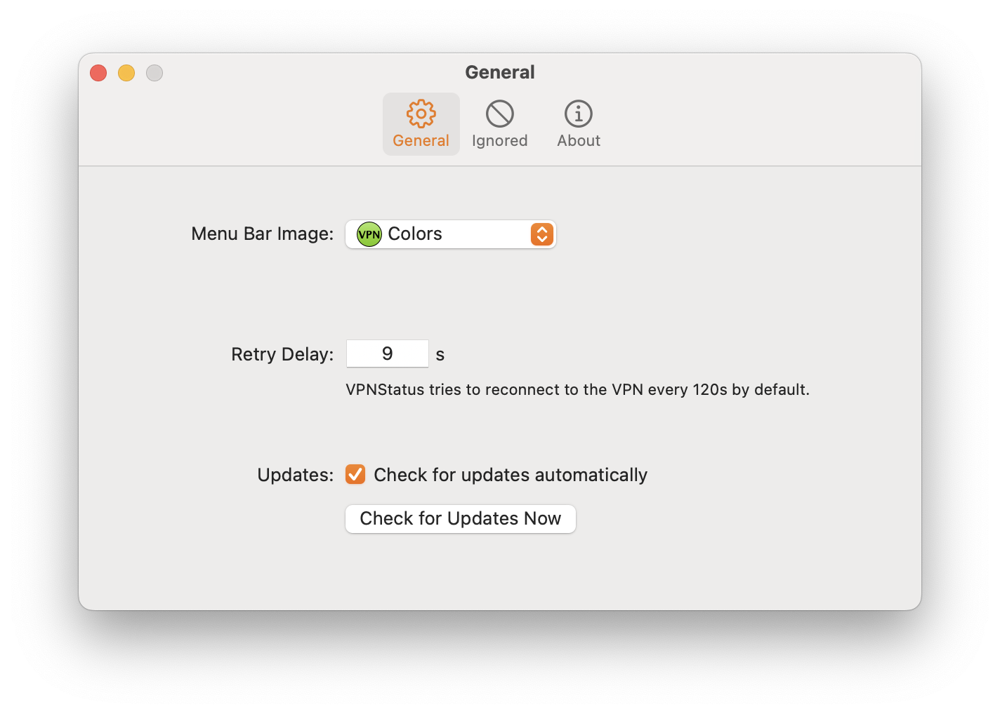
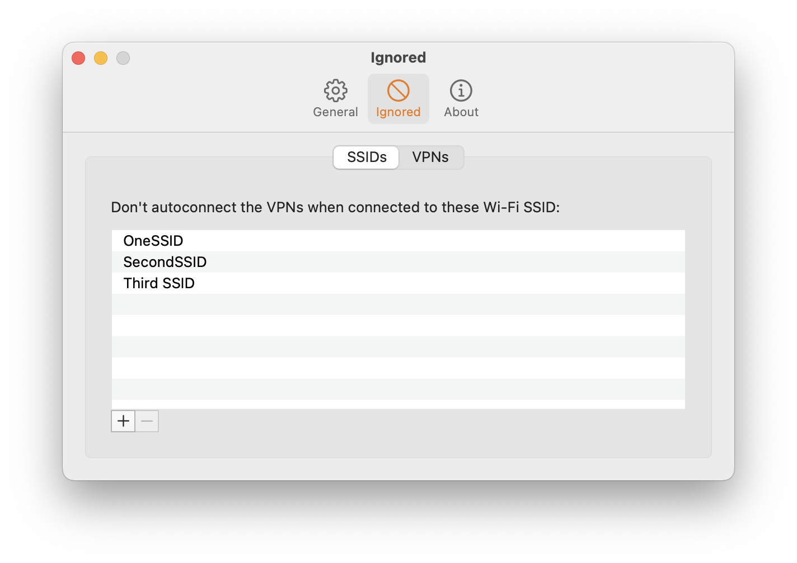
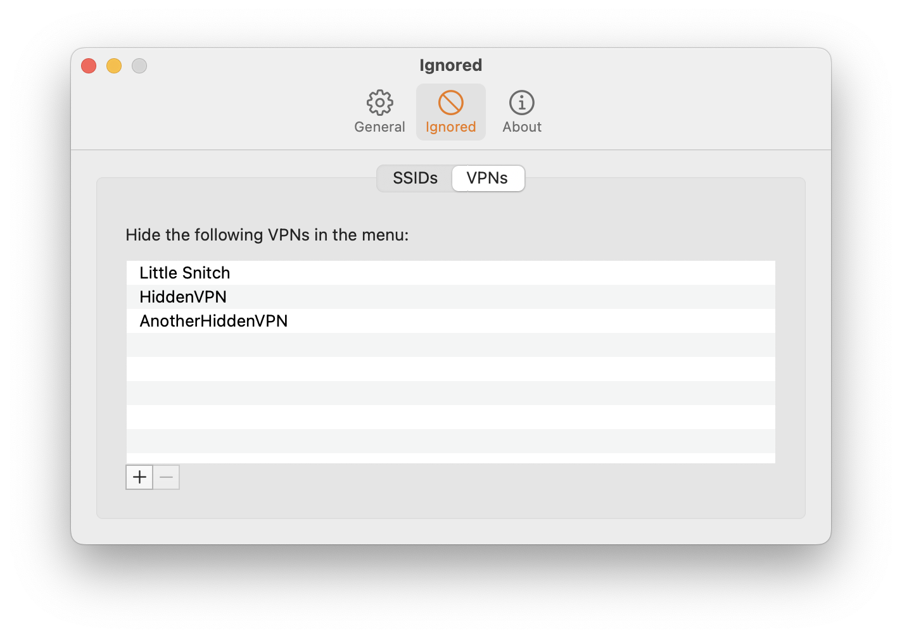

# VPNStatus
VPNStatus, a replacement for macOS builtin VPN Status

Blog post: [https://blog.timac.org/2018/0719-vpnstatus/](https://blog.timac.org/2018/0719-vpnstatus/)

<div align="center">
<!-- shields -->
<!-- downloads -->
<a href="https://github.com/Timac/VPNStatus/releases">

</a>
<!-- version -->
<a href="https://github.com/Timac/VPNStatus/releases">

</a>
<!-- license -->
<a href="https://github.com/Timac/VPNStatus/blob/master/LICENSE.txt">

</a>
<!-- platform -->
<a href="https://github.com/Timac/VPNStatus">

</a>

<br/>
<br/>
</div>


# Description
VPNStatus, an application that replicates some functionalities of macOS built-in VPN status menu:

- list the VPN services and their status
- connect to a VPN service
- disconnect from a VPN service
- possibility to auto connect to a VPN service if the application is running
- Completely free ([donations welcome](https://github.com/sponsors/Timac)) with the source code transparently available

# Installation


## Precompiled

You can download and install a precompiled and signed version of VPNStatus and vpnutil at [https://github.com/Timac/VPNStatus/releases](https://github.com/Timac/VPNStatus/releases).


## Homebrew

Alternatively, you can use Homebrew:

```
brew tap timac/vpnstatus
brew install timac/vpnstatus/vpnutil
brew install --cask timac/vpnstatus/vpnstatus
```


# Settings window

VPNStatus lets you tweak the settings in the preferences window:




# Retry Delay

VPNStatus tries to reconnect to the VPN every 120s by default. You can change this value in the settings.


# Ignored SSIDs

VPNStatus can optionally ignore one or more SSIDs, such that services are **not** autoconnected when the current Wi-Fi SSID is on the ignored list.



With the above example, if the current Wi-Fi network SSID is `OneSSID`, `SecondSSID`, or `Third SSID`, then the VPN will **not** autoconnect.

If the Wi-Fi network SSID is, say, `FourthSSID`, the VPN service **will** autoconnect, because it is not on the list.

Note that SSIDs **are** case-sensitive.

Starting in macOS 14 Sonoma, reading the Wi-Fi SSID requires Location Services access. Without the Location Services access enabled, VPNStatus can't ignore SSIDs while autoconnecting. VPNStatus now checks the Location Services authorization and displays a menu item to grant the permissions.


# Hide VPNs

There are some VPN configurations that you might not want to see in VPNStatus. This is the case of third-party content filter configurations like Little Snitch. 

By default, VPNStatus will hide the Little Snitch content filter configuration. You can override the preference to hide more VPN configurations:


